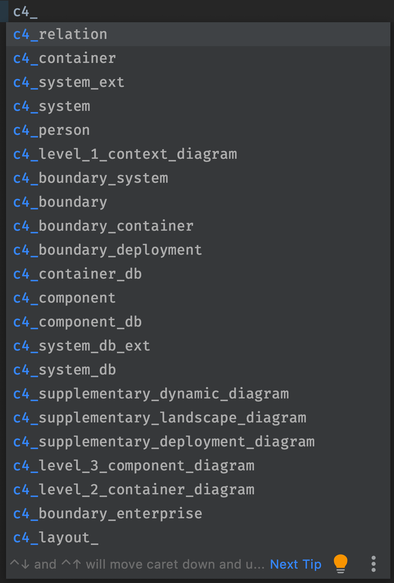

# IntelliJ Live Template for supporting creation of C4 model diagrams with C4-PlantUML.

# Prerequisites

[Graphviz download](https://graphviz.gitlab.io/download/)  
[PlantUML graphviz notes](http://plantuml.com/graphviz-dot)  
[PlantUML Integration](https://plugins.jetbrains.com/plugin/7017-plantuml-integration)

# Install

1. Download [IntelliJ live template](./c4_live_template.zip) ZIP file for [C4-PlantUML](https://github.com/RicardoNiepel/C4-PlantUML).
2. Select `File | Manage IDE Settings | Import Settings` from the IntelliJ IDEA menu.
3. Specify the path to the downloaded `c4_live_template.zip` file.4. In the Import Settings dialog, select the Live templates checkbox and click OK.
4. Restart IntelliJ.

# Usage

* Create new PlantUML file (.puml).
* Type `c4_` for displaying artifacts templates for [C4-PlantUML](https://github.com/RicardoNiepel/C4-PlantUML).

### Templates

