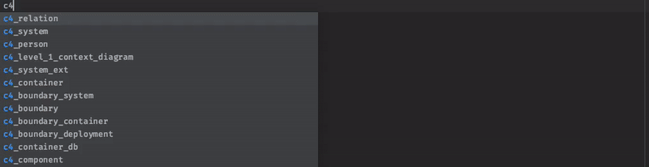
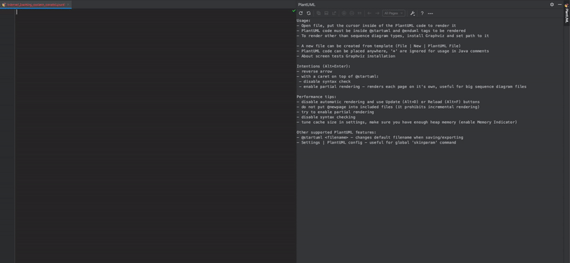

# IntelliJ Live Template for supporting creation of C4 model diagrams with C4-PlantUML.

# Demo

# Prerequisites

### Theory
[The C4 model for visualising software architecture](https://c4model.com/)  
[C4-PlantUML](https://github.com/RicardoNiepel/C4-PlantUML)

### Tools  
[Graphviz download](https://graphviz.gitlab.io/download/)  
[PlantUML Integration](https://plugins.jetbrains.com/plugin/7017-plantuml-integration)

# Install

1. Download one of:
    * [IntelliJ live template](C4-PlantUML/stawirej/c4_live_template.zip) for [stawirej/C4-PlantUML](https://github.com/stawirej/C4-PlantUML)
    * [IntelliJ live template](C4-PlantUML/RicardoNiepiel/c4_live_template.zip) for [RicardoNiepel/C4-PlantUML](https://github.com/RicardoNiepel/C4-PlantUML).  
2. Select `File | Manage IDE Settings | Import Settings` from the IntelliJ IDEA menu.
3. Specify the path to the downloaded ZIP file: `c4_live_template.zip`.
4. In the Import Settings dialog, select the Live templates checkbox and click OK.
4. Restart IntelliJ.

# Usage

* Create new PlantUML file (.puml).
* Type `c4_` for displaying artifacts templates for C4-PlantUML
* Live template create correct C4 model artifact with stubbed arguments. 
    * E.g. alias, label, type, technology, description
* Replace stubbed arguments with desired values.

### Templates

> Depending on used Live Template, it has different set of templates and will include C4 source files from 
> [stawirej/C4-PlantUML](https://github.com/stawirej/C4-PlantUML) or [RicardoNiepel/C4-PlantUML](https://github.com/RicardoNiepel/C4-PlantUML).

* c4_level_1_context_diagram
    * Create file content for the system context diagram.
* c4_level_2_container_diagram
    * Create file content for the system container diagram. 
* c4_level_3_component_diagram
    * Create file content for the component diagram. 
* c4_person
* c4_system
* c4_system_ext
* c4_system_db
* c4_system_db_ext
* c4_container
* c4_container_db
* c4_container_ext (supported only in [stawirej/C4-PlantUML](https://github.com/stawirej/C4-PlantUML))
* c4_container_db_ext (supported only in [stawirej/C4-PlantUML](https://github.com/stawirej/C4-PlantUML))
* c4_component
* c4_component_db
* c4_component_ext (supported only in [stawirej/C4-PlantUML](https://github.com/stawirej/C4-PlantUML))
* c4_component_db_ext (supported only in [stawirej/C4-PlantUML](https://github.com/stawirej/C4-PlantUML))
* c4_supplementary_dynamic_diagram
* c4_supplementary_landscape_diagram
* c4_supplementary_deployment_diagram
* c4_boundary
    * Boundary(alias, label), Boundary(alias, label, type)
* c4_boundary_enterprise
* c4_boundary_system
* c4_boundary_container
* c4_boundary_deployment
* c4_relation
    * Variations: Rel, Rel_L, Rel_R, Rel_U, Rel_D
* c4_layout_
    * Variations: Lay_L, Lay_R, Lay_U, Lay_D

## License

This project is licensed under the MIT License - see the [LICENSE](LICENSE) file for details